---
title: Complex number arithmetic
date: 15-01-2013
imgpath: /media/complex-numbers-arithmetics
tags:
    - math
    - xaos
    - fractals
---

In this post we will skip elementary mathematical operations (i.e. addition, substraction, division, multiplication) and focus only on functions with complex number arguments (e.q. trigonometric functions, logarithms etc.). But before that, we should write down basic definitions and equations.

Algebraic form of complex number

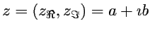

Geometric representation of complex number

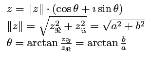

Euler's exponential form of complex number

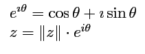

and Euler's formulas

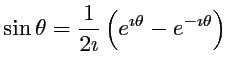

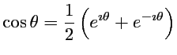

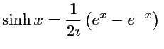

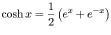

Now you can do some math transformation to get what we want...

### Logarithms

#### exponential function of complex number

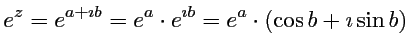

#### complex natural logarithm

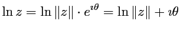

#### complex logarithm of any base

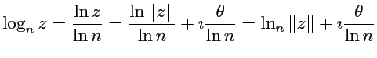

### Trigonometry

using Euler's formulas for complex argument we can get

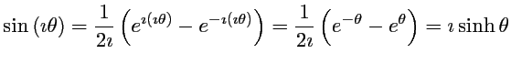

and

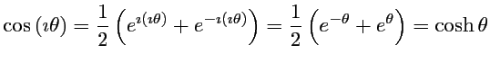

and also

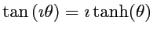

and by setting 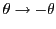 in above equations, we get these relations

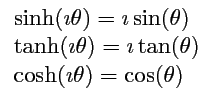

using trigonometrical realtions for sine and cosine we can get

#### sine functions for complex numbers

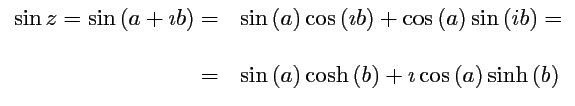

#### cosine functions for complex numbers

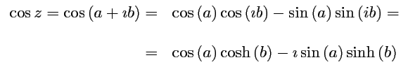

#### tangent functions for complex numbers

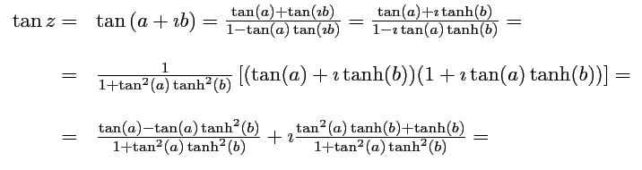

in next step we will get hyperbolic trigonometry functions, using some well known realations (similar to those used previously).

#### hyperbolic sine functions for complex numbers

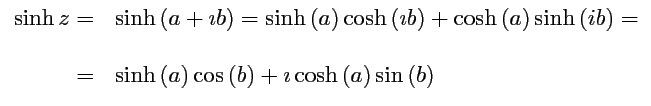

#### hyperbolic cosine functions for complex numbers

#### hyperbolic tangent functions for complex numbers

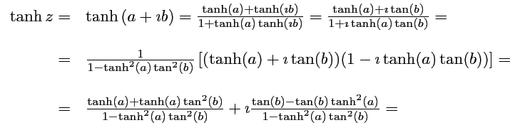

### Power functions

there are three different ways to evaluate power functions in complex plane, we get one way for complex
number to the integer power (de Moivre relation), other for complex number to the real power and quite similar complex number to the complex number.
complex number to integer power (de Moivre)

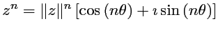

#### real exponents with complex bases

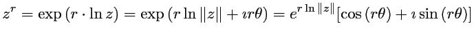

#### complex exponents with complex bases

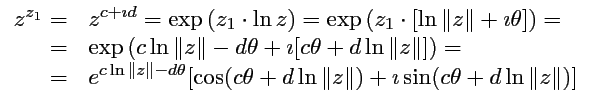

The last case is when we want to calculate

#### complex exponents of integer (or real) bases

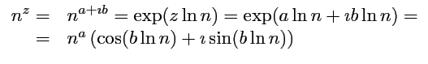

---

*In the sffe source* — these identities are what the complex back-ends
implement. The **GSL** build (`lib/src/sffe_cmplx_gsl.c`) delegates to the
`gsl_complex_*` routines (`gsl_complex_exp`, `gsl_complex_log`,
`gsl_complex_sin/cos/tan`, `gsl_complex_sinh/cosh/tanh`, `gsl_complex_pow`,
etc.). The **x87 FPU** build implements them by hand in
`lib/src/asm/cmplx.S` / `cmplx.asm` (`sffecexp`, `sffecln`, `sffeclog`,
`sffecsin`, `sffeccos`, `sffectan`, `sffecsinh`, …, `sffeccpow`,
`sffecpowd`, `sffecpowi`, `sffecpowc`, `sffecsqrt`); the de&nbsp;Moivre
*n*-th root above is `sffecrtni` / `sfrtni`. Note that a few GSL entries are
still stubs or approximations (e.g. `sfatan2`, `sfceil`/`sffloor`, `sfsqr`),
and the complex back-ends currently lag the refactored core — see the
project `CLAUDE.md` for the current state.
